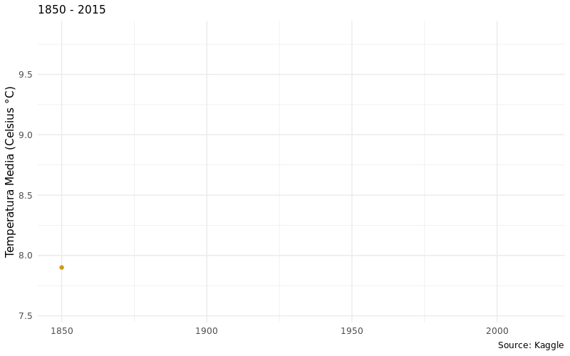

```{r setup, include=FALSE}
knitr::opts_chunk$set(echo = FALSE, message = FALSE)
```

## Analisi sul cambiamento climatico

Negli ultimi anni si sente sempre di più parlare del cambiamento climatico e del surriscaldamento globale, non solo, anche gli avvenimenti ambientali, come per esempio precipitazioni e temperature, parlano da sole.

Lo scopo di questa analisi è quello di fornire un quadro generale sulla questione.
In particolare andremo a cercare una risposta alle seguenti domande:

- Come sono cambiate le temperature medie della superficie terrestre nel corso degli anni?
- Com' è cambiata l'emissione di CO2 nel corso degli anni?
- Qual è la regione che emette più anidride carbonica? E come è cambiato l'andamento nel corso degli anni?
- C'è correlazione tra un'elevata emissione e il numero della popolazione?
...


```{r, echo = FALSE, results='hide', librerie}
# Importiamo le librerie
library(readr)
library(dplyr)
library(ggplot2)
library(tidyr)
library(maps)
library(mapproj)
library(shiny)
library(ggthemes)
library(sf)
library(gganimate)
library(gifski)
library(plotly)
```


```{r, echo = FALSE, dataset}
# Importiamo i datasets
global_temp_by_country <- read_csv("./datasets/GlobalLandTemperaturesByCountry.csv")
iso3_code <- read_csv("datasets/countries_codes_and_coordinates.csv")

state_code <- read_csv("datasets/state_code.csv") # forse sara' da togliere

global_temperature <- read_csv("datasets/GlobalTemperatures.csv")
co2_emission <- read_csv("./datasets/annual-co-emissions-by-region.csv")
co2_emission_percapita <- read_csv("datasets/co-emissions-per-capita.csv")
electricity_prod <- read_csv("datasets/electricity-prod-source-stacked.csv")
```


```{r, echo=FALSE, conversioneData}
# Divido la data in Year, Month, Day
global_temp_by_country = global_temp_by_country %>%
  drop_na() %>%
  separate(col = dt, into = c("Year", "Month", "Day"), convert = TRUE) %>%
  filter(Year > 1849)
  

global_temperature = global_temperature %>%
  separate(col = dt, into = c("Year", "Month", "Day"), convert = TRUE)
```


## Andamento delle temperature medie

```{r, echo=FALSE, grafico-temperatura}

global_mean_temperature = global_temperature %>%
  drop_na() %>%
  group_by(Year) %>%
  summarize(LandAverageTemperatureByYear = mean(LandAverageTemperature)) %>%
  ggplot(aes(x = Year, y = LandAverageTemperatureByYear)) +
  geom_line(color = "gold1") +
  labs(title = "Andamento annuale della temperatura",
       subtitle = "1850 - 2015",
       y = "Temperatura Media (Celsius °C)",
       caption = "Source: Kaggle") +
  theme_minimal() +
  theme(text = element_text(family = "DM Sans Medium"),
        axis.title.x = element_blank(),
        legend.position = "bottom") +
  scale_x_continuous(limits = c(1850, 2015)) +
  geom_point(color = "goldenrod3")
  

global_mean_temperature.animation = global_mean_temperature +
  transition_reveal(Year)

animate(global_mean_temperature.animation, height = 500, width = 800, fps = 30, end_pause = 60, res = 100, duration = 10, renderer = gifski_renderer("mean_temp.gif", loop = FALSE))
```
<center>

</center>


## Cambiamento delle temperature superficiali del nostro pianeta
```{r, echo=FALSE, dati-mappa-temperatura}
# Vado a effettuare la media annuale per ogni stato, al fine di ridurre la dimensionalità del dataset.
global_temp_by_country = global_temp_by_country %>%
  group_by(Country, Year) %>%
  summarize(`Media Annuale` = mean(AverageTemperature)) %>%
  drop_na()

# Unisco il dataset delle temperature al dataset dei codici iso-3, al fine di mappare correttamente gli stati  
gt <- global_temp_by_country %>% 
  left_join(., iso3_code, by = "Country") %>%
  select(Year, `Media Annuale`, Country, `Alpha-3 code`) %>%
  drop_na()
  
```
<div id="maptemp">
```{r, echo=FALSE, mappa-temperatura, fig.align='center'}

fig <- plot_geo(gt, frame = ~Year) %>%
  add_trace(locations = ~`Alpha-3 code`,
            z = ~`Media Annuale`,
            zmin = min(gt$`Media Annuale`),
            zmax = max(gt$`Media Annuale`),
            color = ~`Media Annuale`,
            colorscale = "Hot_r") %>%
  layout(title = "Temperature Medie Annuali\n1850 - 2013",
         geo = list(
           showocean = TRUE,
           oceancolor = rgb(0,1,1)
         )) %>%
  animation_opts(20) %>%
  colorbar(title = "Media", ticksuffix = " °C") %>%
  config(displayModeBar = FALSE)

fig
```
</div>


## Emissioni annuali di CO2

Come sono cambiate le emissioni medie annuali negli anni?

```{r, echo=FALSE, emissioni-annuali}
world_co2_emission = co2_emission %>%
  filter(Entity == "World") %>%
  ggplot(aes(x = Year, y = `Annual CO2 emissions`)) +
  geom_line(size = 1, color = "darkolivegreen2") + 
  labs(title = "Emissioni Annuali CO2", 
       subtitle = "1750 - 2019",
       y = "Emissioni annue di CO2 (tonnellate)",
       caption = "Source: Global Carbon Project") +
  scale_y_continuous(labels = scales::comma) +
  theme_minimal() +
  geom_point(color = "forestgreen") +
  theme(text = element_text(family = "DM Sans Medium"),
        axis.title.x = element_blank()
  )

world_co2_emission.animation = world_co2_emission +
  transition_reveal(Year) +
  view_follow()

#animate(world_co2_emission.animation, height = 500, width = 800, fps = 30, end_pause = 60, res = 100, duration = 10, renderer = gifski_renderer("world_co2.gif", loop = FALSE))

```
<center>

</center>


## Emissioni annuali di CO2 delle regioni mondiali

```{r, echo=FALSE, emissioni-regioni}
# Creo un filtro (grazie a un array) con le regioni mondiali
country_filter <- c("International transport", "Oceania", "Asia (excl. China & India)", "China", "India", "Africa", "South America", "North America (excl. USA)", "United States", "Europe (excl. EU-27)", "EU-27")

co2_region_emission = co2_emission %>%
  rename(Regione = Entity) %>%
  filter(Regione %in% country_filter) %>%
  ggplot(aes(x = Year, y = `Annual CO2 emissions`, fill = Regione)) +
  geom_area(alpha = 0.6, size = .5, colour = "white") +
  labs(y = "Emissioni Annuali CO2 (tonnellate)") +
  scale_fill_brewer(palette = "Spectral") +
  scale_y_continuous(labels = scales::comma) + 
  scale_x_continuous(breaks = seq(1750, 2019, 50)) +
  theme_minimal() +
  #settare un tema può sovrascrivere ciò che viene messo in theme()
  theme(axis.title.x = element_blank()) 

ggplotly(co2_region_emission) %>%
  config(displayModeBar = FALSE)
```


## Emissioni pro capite di CO2
```{r, echo=FALSE, emissioni-co2-procapite}
co2_emission_percapita = co2_emission_percapita %>%
  filter(Year == 2019)
```

```{r, echo=FALSE, mappa-emissioni-procapite}

co2_map_percapita <- plot_geo(co2_emission_percapita) %>%
  add_trace(locations = ~Code,
            z = ~`Per capita CO2 emissions`,
            zmin = 0,
            zmax = 20, 
            color = ~`Per capita CO2 emissions`,
            colorscale = "Inferno") %>%
  layout(title = "Emissioni CO2 pro capite\n 2019") %>%
  colorbar(title = "Emissione CO2 procapite", ticksuffix = " tonnellate") %>%
  config(displayModeBar = FALSE)

co2_map_percapita

```


## Top 15 paesi 
```{r, echo=TRUE}

co2_emission_percapita %>%
  select(Entity, Year, `Per capita CO2 emissions`) %>%
  arrange(desc(`Per capita CO2 emissions`)) %>%
  head(n = 15)
```


## Produzione di energia per stato
```{r, echo=FALSE, shiny-app-energie}
ui <- fluidPage(
  titlePanel("Come si produce energia nel mondo?"),
  
  sidebarLayout(
    sidebarPanel(
      fluidRow(
        column(6, checkboxGroupInput(
          "countrySelector",
          label = "Seleziona Stato(i)",
          choices = list("Francia" = "France",
                         "Australia" = "Australia",
                         "Germania" = "Germany",
                         "Inghilterra" = "United Kingdom",
                         "Spagna" = "Spain",
                         "Stati Uniti" = "United States",
                         "Cina" = "China",
                         "India" = "India")
        )),
        column(6, checkboxGroupInput(
          "energySelector",
          label = "Seleziona Fonte(i) Energia",
          choices = list("Carbone" = "Electricity from coal (TWh)",
                         "Nucleare" = "Electricity from nuclear (TWh)",
                         "Gas" = "Electricity from gas (TWh)",
                         "Petrolio" = "Electricity from oil (TWh)",
                         "Eolico" = "Electricity from wind (TWh)",
                         "Idroelettrico" = "Electricity from hydro (TWh)")
        ))
      )
    ),
    mainPanel(plotOutput("o"))
  )
)


server <- function(input, output) {
  output$o <- renderPlot({
    
    state_filter <- c("France", "Australia", "Germany", "United Kingdom", "Spain", "United States", "China", "India")
    
    electricity_prod %>%
      gather(key = "Electricity",
          value = "TWh produced",
          c(-Entity, -Code, -Year)) %>%
      filter(Year == 2019, Entity %in% state_filter) %>%
      group_by(Entity) %>%
      mutate(pct = prop.table(`TWh produced`)) %>%
      filter(Entity %in% input$countrySelector, Electricity %in% input$energySelector) %>%
      ggplot(aes(x = Entity, y = `TWh produced`, fill = Electricity, label = scales::percent(pct, accuracy = 0.01L))) +
      geom_bar(stat = "identity", position = "dodge") +
      geom_text(position = position_dodge(width = .9),
                vjust = -0.5,
                size = 3) +
      labs(title = "2019", y = "Tera Watt/h prodotti") + 
      scale_fill_discrete(name = "Fonti Energetiche", labels = c("Electricity from coal (TWh)" = "Carbone", 
                                                                 "Electricity from nuclear (TWh)" = "Nucleare",
                                                                 "Electricity from gas (TWh)" = "Gas",
                                                                 "Electricity from oil (TWh)" = "Petrolio",
                                                                 "Electricity from wind (TWh)" = "Eolico",
                                                                 "Electricity from hydro (TWh)" = "Idroelettrico")) +
      theme_bw() +
      theme(plot.title = element_text(hjust = 0.5, size = 16), 
        axis.title.x = element_blank(),
        axis.text = element_text(size = 16))
    
    
  })
}

shinyApp(ui, server)
```


